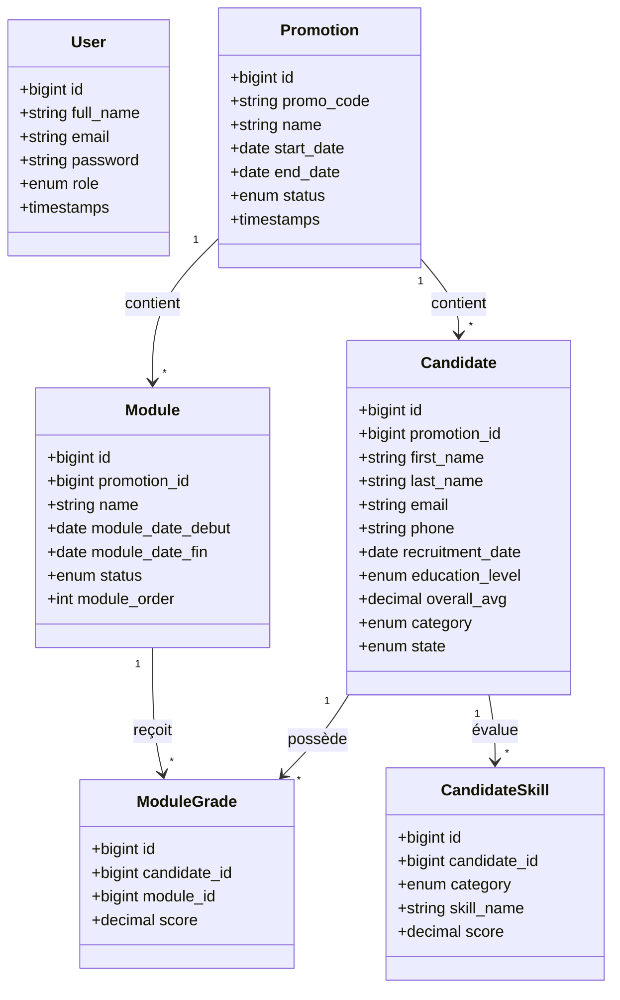
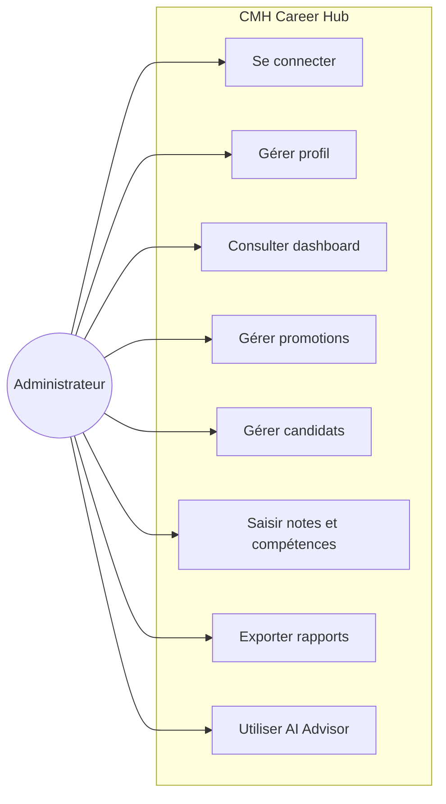
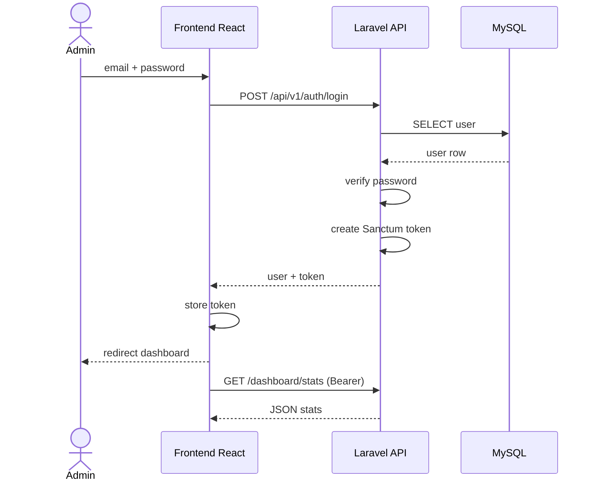

# Annexe UML — CMH Career Hub

## Diagramme de classes (Mermaid)

```mermaid
classDiagram
    class User {
        +bigint id
        +string full_name
        +string email
        +string password
        +enum role
        +timestamps
    }

    class Promotion {
        +bigint id
        +string promo_code
        +string name
        +date start_date
        +date end_date
        +enum status
        +timestamps
    }

    class Module {
        +bigint id
        +bigint promotion_id
        +string name
        +date module_date_debut
        +date module_date_fin
        +enum status
        +int module_order
    }

    class Candidate {
        +bigint id
        +bigint promotion_id
        +string first_name
        +string last_name
        +string email
        +string phone
        +date recruitment_date
        +enum education_level
        +decimal overall_avg
        +enum category
        +enum state
    }

    class ModuleGrade {
        +bigint id
        +bigint candidate_id
        +bigint module_id
        +decimal score
    }

    class CandidateSkill {
        +bigint id
        +bigint candidate_id
        +enum category
        +string skill_name
        +decimal score
    }

    Promotion "1" --> "*" Module : contient
    Promotion "1" --> "*" Candidate : contient
    Candidate "1" --> "*" ModuleGrade : possède
    Module "1" --> "*" ModuleGrade : reçoit
    Candidate "1" --> "*" CandidateSkill : évalue
```

## Cas d'utilisation (Mermaid)

```mermaid
flowchart LR
    Admin((Administrateur))
    subgraph Systeme[CMH Career Hub]
        UC1[Se connecter]
        UC2[Gérer profil]
        UC3[Consulter dashboard]
        UC4[Gérer promotions]
        UC5[Gérer candidats]
        UC6[Saisir notes et compétences]
        UC7[Exporter rapports]
        UC8[Utiliser AI Advisor]
    end
    Admin --> UC1
    Admin --> UC2
    Admin --> UC3
    Admin --> UC4
    Admin --> UC5
    Admin --> UC6
    Admin --> UC7
    Admin --> UC8
```

## Séquence — Authentification

```mermaid
sequenceDiagram
    actor Admin
    participant React as Frontend React
    participant API as Laravel API
    participant DB as MySQL

    Admin->>React: email + password
    React->>API: POST /api/v1/auth/login
    API->>DB: SELECT user
    DB-->>API: user row
    API->>API: verify password
    API->>API: create Sanctum token
    API-->>React: user + token
    React->>React: store token
    React-->>Admin: redirect dashboard
    React->>API: GET /dashboard/stats (Bearer)
    API-->>React: JSON stats
```
