# Diagrammes UML — CareerHub

> Tous les diagrammes sont au format **Mermaid** (compatible GitHub, GitLab, VS Code, Notion).  
> Visualisation en ligne : [mermaid.live](https://mermaid.live)

---

## 1. Diagramme de cas d'utilisation

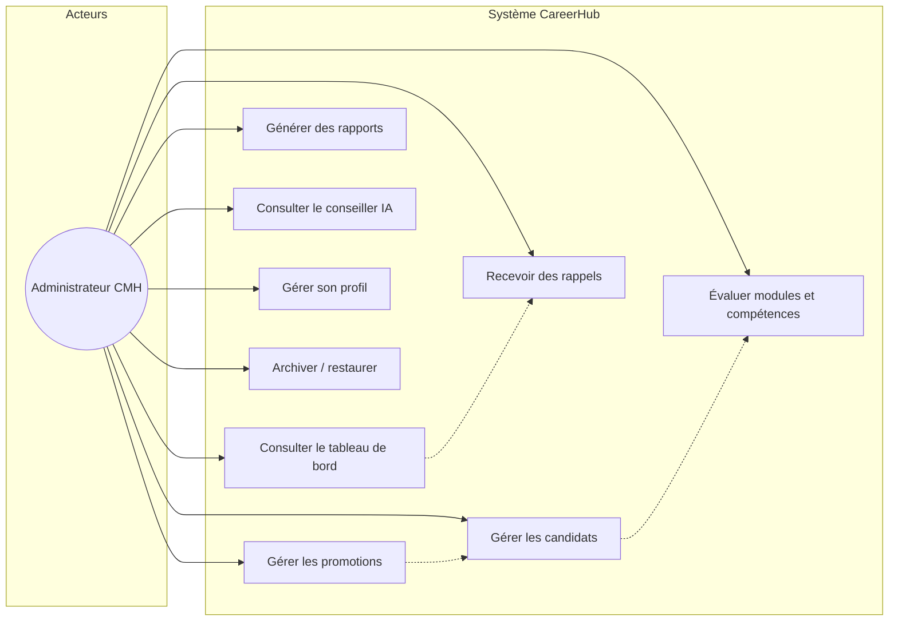

### Description des cas d'utilisation

| ID | Cas d'utilisation | Description |
|----|-------------------|-------------|
| UC1 | Gérer les promotions | Créer, modifier, archiver des cohortes de formation |
| UC2 | Gérer les candidats | Recruter, modifier profil, changer statut, archiver |
| UC3 | Évaluer | Saisir notes modules (/20) et soft skills (/5) |
| UC4 | Tableau de bord | KPIs, démographie, promotions actives |
| UC5 | Rapports | Export PDF, Excel, CSV, HTML (individuel ou promotion) |
| UC6 | Rappels | Alertes opérationnelles (dates, effectifs, taux de réussite) |
| UC7 | Conseiller IA | Chat Gemini avec contexte analytics anonymisé |
| UC8 | Profil | Modifier nom, email, mot de passe, thème |
| UC9 | Archivage | Archiver/restaurer promotions et candidats |

---

## 2. Diagramme de classes — Modèle domaine

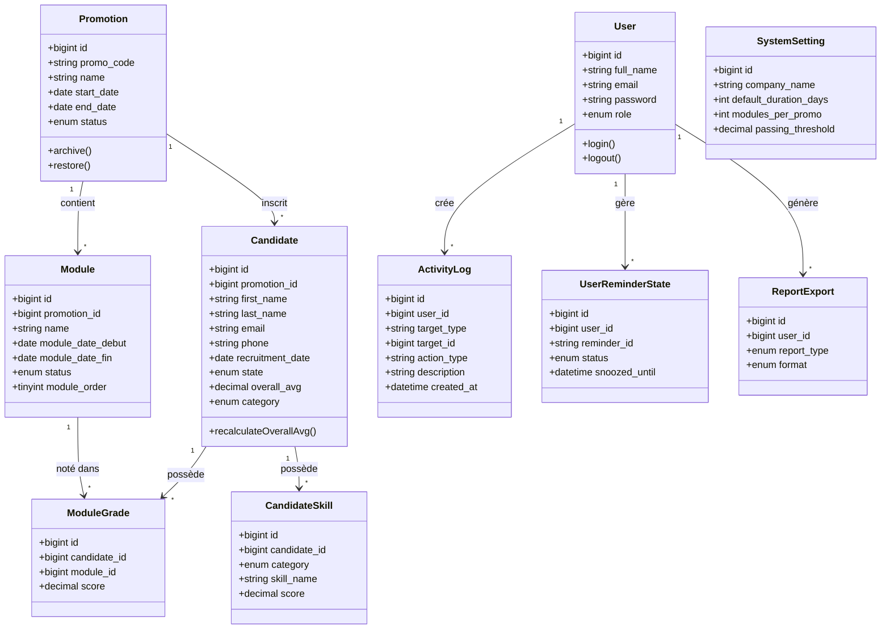

---

## 3. Diagramme de classes — Couche services (Backend)

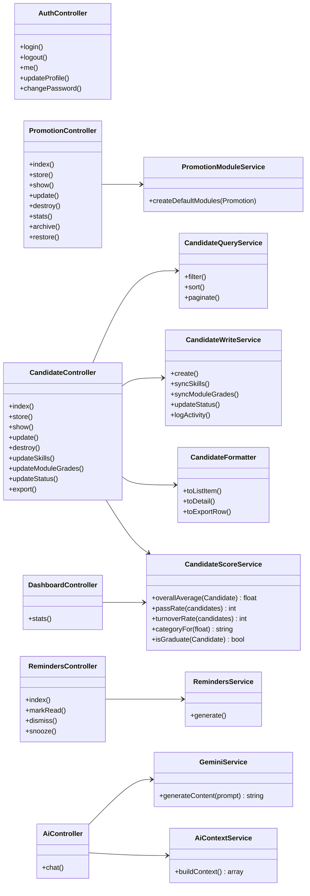

---

## 4. Diagramme de composants — Architecture système

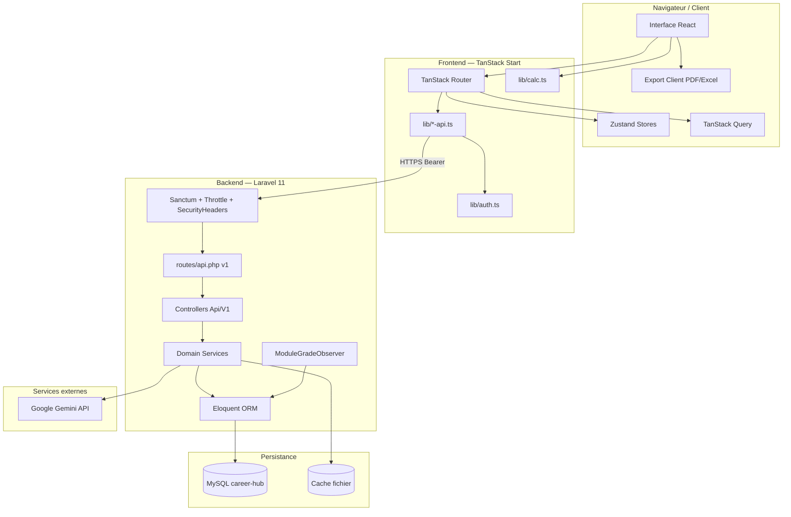

---

## 5. Diagrammes de séquence

### 5.1 Authentification

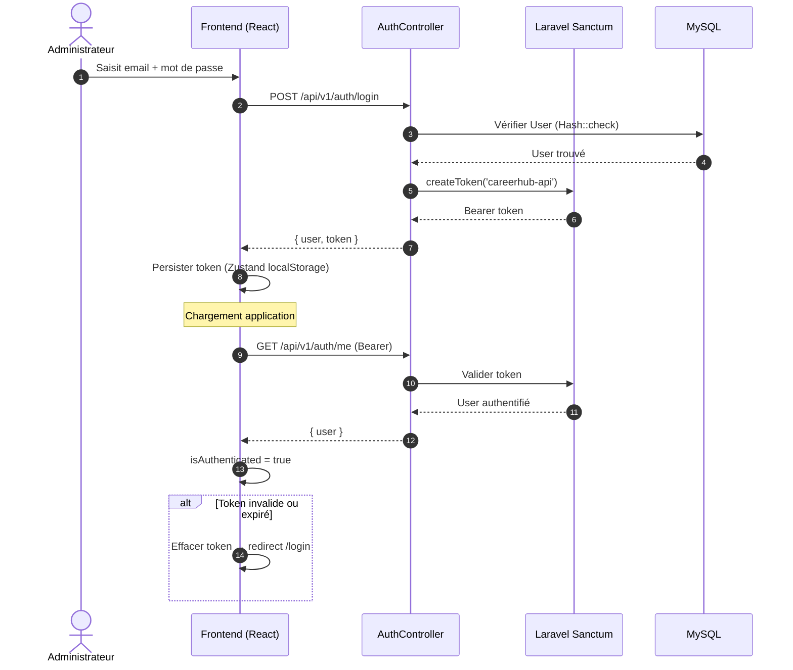

### 5.2 Création d'une promotion

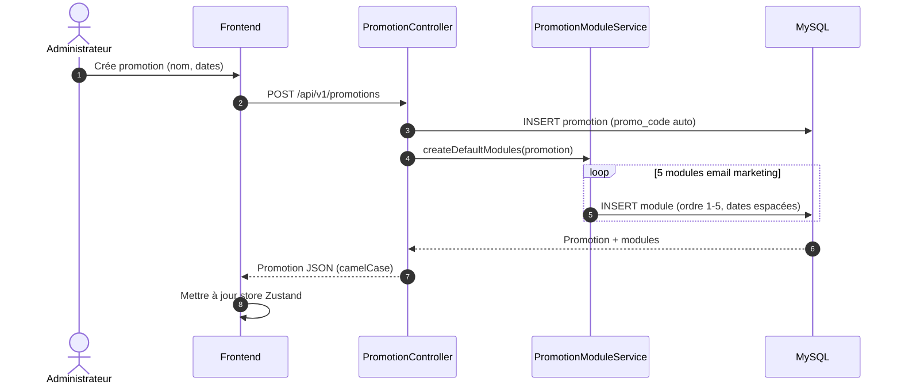

### 5.3 Évaluation d'un candidat

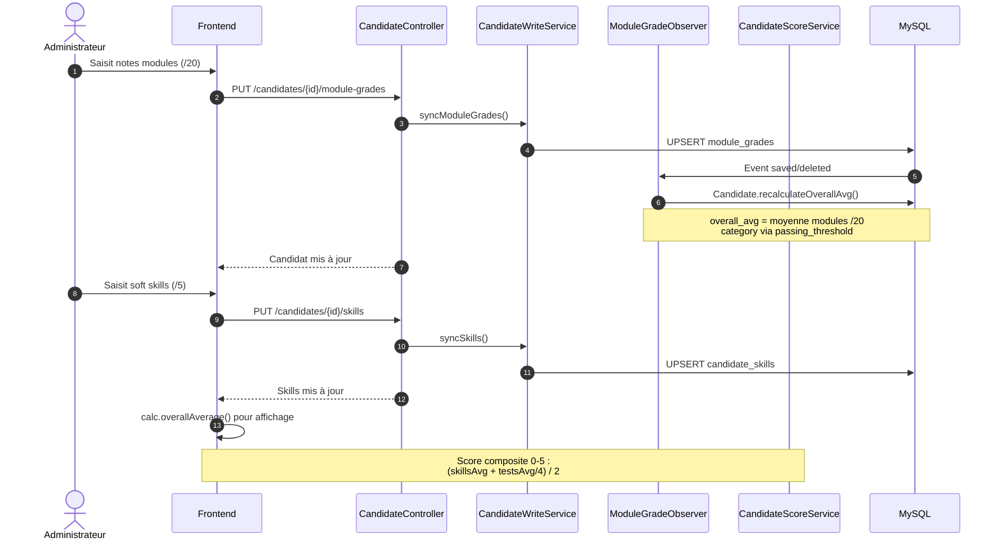

### 5.4 Conseiller IA (Gemini)

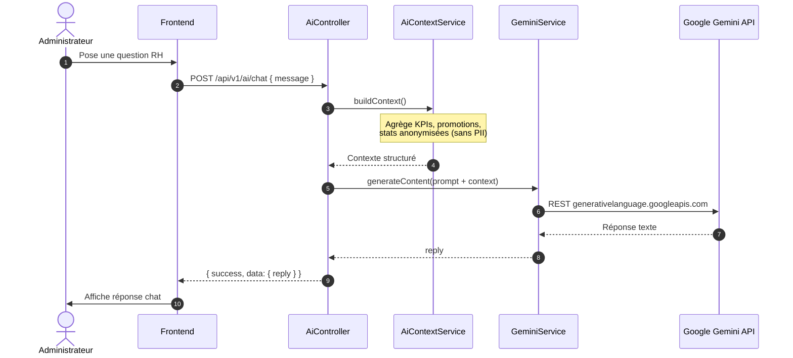

### 5.5 Génération de rappels

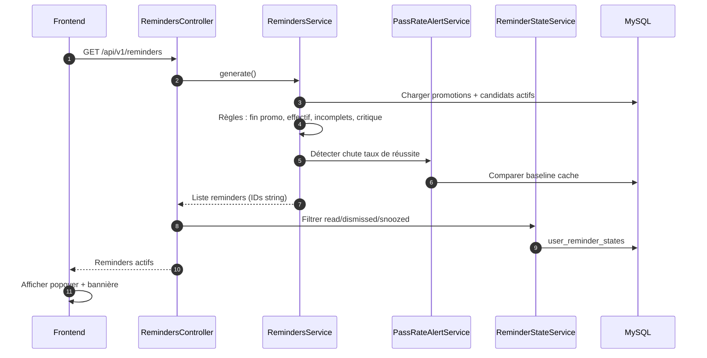

---

## 6. Diagramme de déploiement

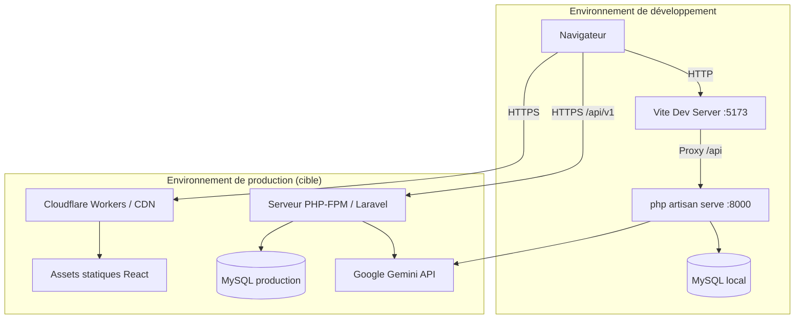

### Ports et URLs

| Environnement | Frontend | Backend API |
|---------------|----------|-------------|
| Développement | `http://127.0.0.1:5173` | `http://127.0.0.1:8000/api/v1` |
| Production | Domaine Cloudflare | `APP_URL` + `/api/v1` |

---

## 7. Diagramme entité-relation (ERD)

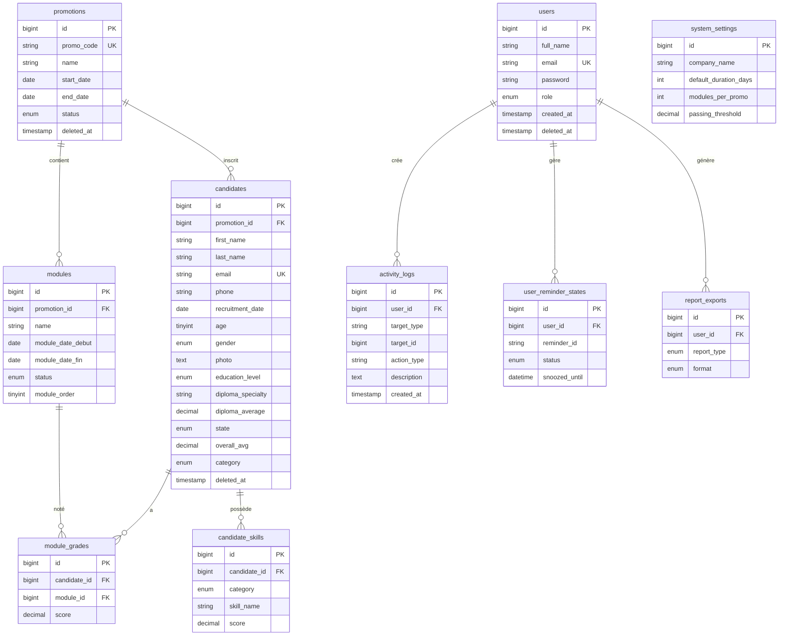

---

## 8. Diagramme d'états — Candidat

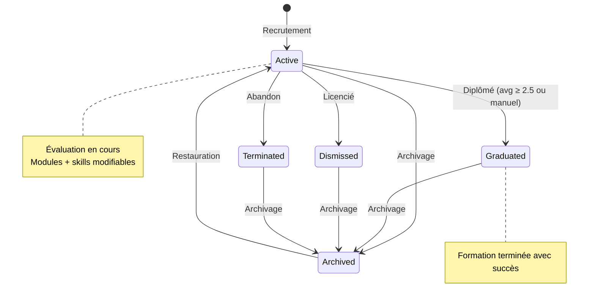

---

## 9. Diagramme d'états — Promotion

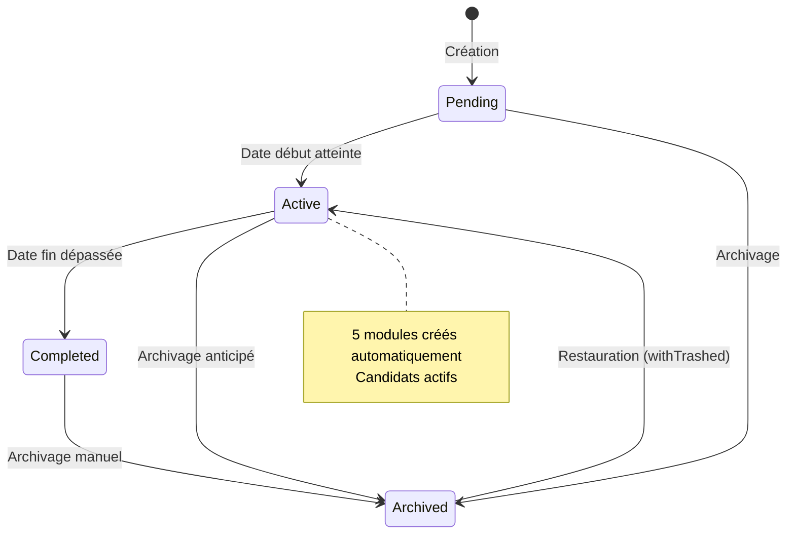

---

## 10. Diagramme de packages — Frontend

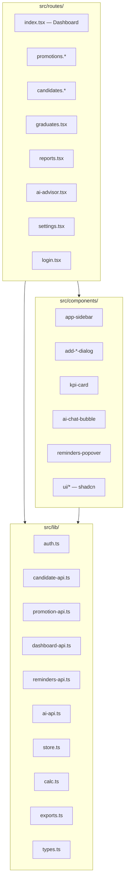

---

*Diagrammes générés à partir du code source CareerHub — CMH — Mai 2026*
