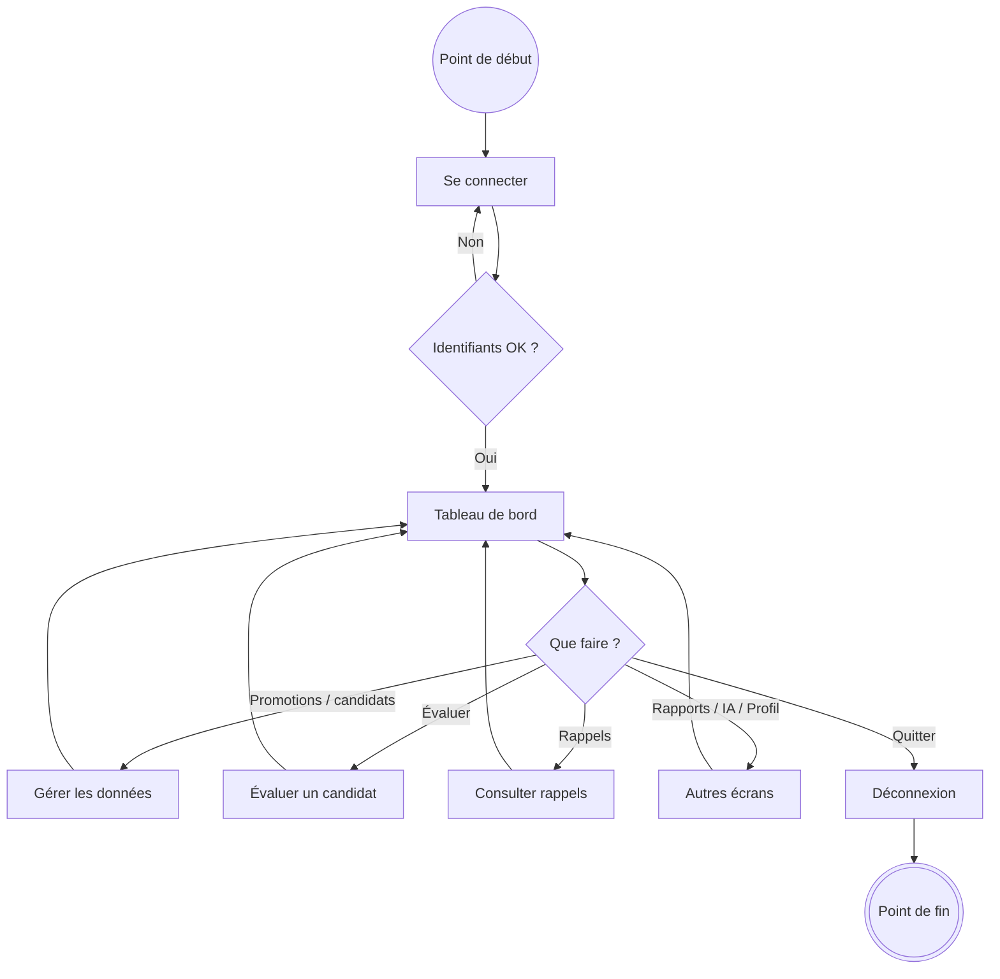
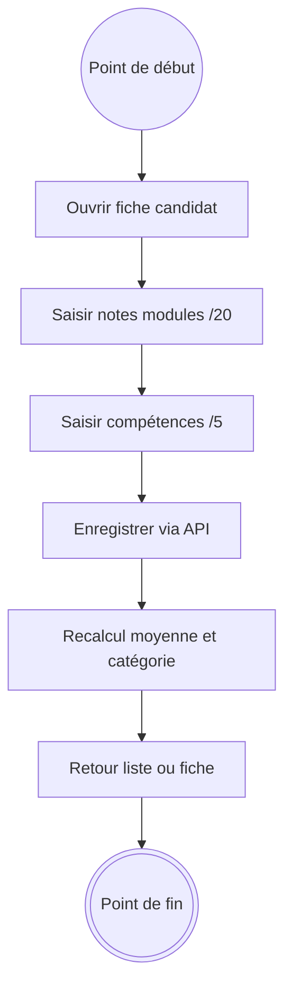
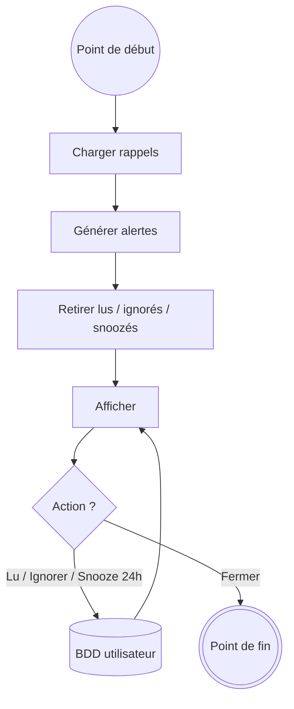
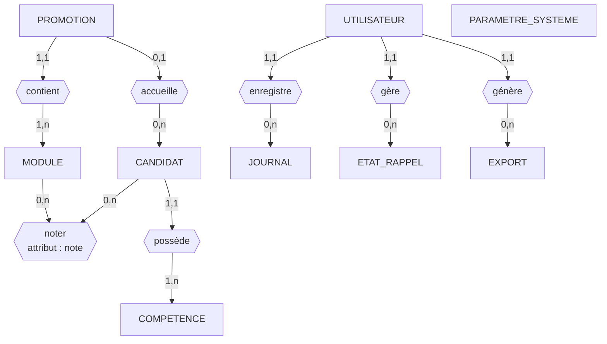
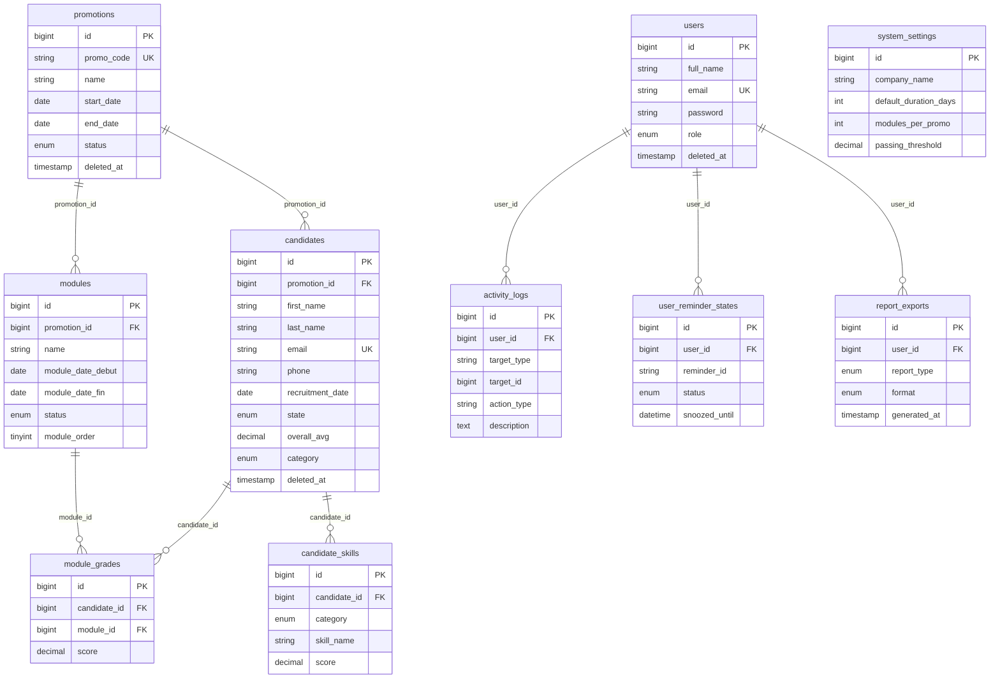

# Modèles de données et diagramme d'activité — CareerHub

> Diagrammes alignés sur le schéma MySQL Laravel (`backend/database/migrations`).  
> Visualisation Mermaid : [mermaid.live](https://mermaid.live)

---

## 1. Diagramme d'activité

Flux simplifié pour l’**administrateur CMH**. Chaque diagramme comporte un **point de début** ● et un **point de fin** ◎ (notation UML).

| Symbole Mermaid | Signification UML |
|-----------------|-------------------|
| `((Point de début))` | État initial — début du flux |
| `(((Point de fin)))` | État final — fin du flux |
| Rectangle | Activité |
| Losange | Décision |

### 1.1 Parcours global



| Étape | Description |
|-------|-------------|
| Connexion | API `POST /auth/login` → token Sanctum |
| Tableau de bord | KPIs, filtres de période, promotions actives |
| Gérer les données | CRUD promotions et candidats |
| Autres écrans | Exports, conseiller IA, paramètres profil |

### 1.2 Évaluer un candidat



| Étape | API |
|-------|-----|
| Notes modules | `PUT …/module-grades` |
| Compétences | `PUT …/skills` |
| Recalcul auto | `ModuleGradeObserver` → `overall_avg`, `category` |

### 1.3 Rappels



Alertes possibles : fin de promotion, effectif faible, profils incomplets, candidats critiques, baisse du taux de réussite.

---

## 2. MCD — Modèle conceptuel de données

**But :** décrire le métier CMH **sans** parler de tables SQL ni de Laravel.

| | MCD (conceptuel) | MLD (logique) — section 3 |
|--|------------------|---------------------------|
| **Niveau** | Quoi existe dans le métier ? | Comment c’est stocké en base ? |
| **Noms** | Français : CANDIDAT, *noter* | Tables anglaises : `candidates`, `module_grades` |
| **Liens** | Associations : *contient*, *noter* | Clés étrangères : `promotion_id`, `candidate_id` |
| **Types** | Domaines métier (dates, notes 0–20) | Types SQL (`bigint`, `decimal`, `enum`) |
| **Exemple clé** | Association *noter* entre CANDIDAT et MODULE | Table `module_grades` (2 FK + `score`) |

Notation MCD : entités en **MAJUSCULES**, associations en *italique*, cardinalités **(min, max)**.

### 2.1 Entités et attributs (métier)

| Entité | Attributs (identifiant souligné) |
|--------|----------------------------------|
| **UTILISATEUR** | <u>#id</u>, nom_complet, email, mot_de_passe, role, date_creation, date_suppression |
| **PROMOTION** | <u>#id</u>, code_promo, nom, date_debut, date_fin, statut, date_creation, date_suppression |
| **MODULE** | <u>#id</u>, nom, date_debut, date_fin, statut, ordre |
| **CANDIDAT** | <u>#id</u>, prenom, nom, email, telephone, date_recrutement, age, genre, photo, niveau_etude, specialite_diplome, moyenne_diplome, etat, moyenne_globale, categorie, date_creation, date_suppression |
| **COMPETENCE** | categorie *(Discipline / Savoir-être)*, nom_competence, note *(0 à 5)* — rattachée à un candidat |
| **PARAMETRE_SYSTEME** | <u>#id</u>, nom_entreprise, duree_defaut_jours, modules_par_promo, seuil_reussite |
| **JOURNAL** | <u>#id</u>, type_cible, id_cible, type_action, description, horodatage |
| **ETAT_RAPPEL** | <u>#id</u>, id_rappel, statut *(read / dismissed / snoozed)*, reporte_jusqua |
| **EXPORT** | <u>#id</u>, type_rapport, format, date_generation |

### 2.2 Associations

| Association | Entités liées | Cardinalités | Remarque |
|-------------|---------------|--------------|----------|
| *contient* | PROMOTION — MODULE | (1,1) — (1,n) | 5 modules par défaut à la création |
| *accueille* | PROMOTION — CANDIDAT | (0,1) — (0,n) | `promotion_id` nullable (candidats non affectés) |
| *noter* | CANDIDAT — MODULE | (0,n) — (0,n) | Attribut de l’association : **note** (0–20), une paire (candidat, module) unique |
| *possède* | CANDIDAT — COMPETENCE | (1,1) — (1,n) | Une compétence par nom et par candidat |
| *enregistre* | UTILISATEUR — JOURNAL | (1,1) — (0,n) | Traçabilité des actions admin |
| *gère* | UTILISATEUR — ETAT_RAPPEL | (1,1) — (0,n) | Un état par couple (utilisateur, id_rappel) |
| *génère* | UTILISATEUR — EXPORT | (1,1) — (0,n) | Historique des exports |

**PARAMETRE_SYSTEME** : entité singleton (configuration globale CMH), sans association obligatoire vers les autres entités métier.

### 2.3 Schéma MCD (vue graphique — métier)

> Pas de tables ni de `FK` ici : les losanges sont des **associations**, pas des tables.



### 2.4 Représentation textuelle (notation Chen)

```
┌─────────────┐         contient          ┌────────┐
│  PROMOTION  │──────────(1,1)─(1,n)───────│ MODULE │
└─────────────┘                           └────────┘
       │
       │ accueille (0,1) ─ (0,n)
       ▼
┌─────────────┐    noter (0,n)    ┌────────┐
│  CANDIDAT   │◄──────(0,n)──────►│ MODULE │  attribut : note
└─────────────┘                   └────────┘
       │
       │ possède (1,1) ─ (1,n)
       ▼
┌─────────────┐
│ COMPETENCE  │
└─────────────┘

┌─────────────┐  enregistre (1,1)-(0,n)  ┌─────────┐
│ UTILISATEUR │──────────────────────────│ JOURNAL │
└─────────────┘                          └─────────┘
       │ gere (1,1)-(0,n)
       ▼
┌──────────────┐     genere (1,1)-(0,n)   ┌────────┐
│ ETAT_RAPPEL  │                          │ EXPORT │
└──────────────┘                          └────────┘

┌───────────────────┐
│ PARAMETRE_SYSTEME │  (configuration globale)
└───────────────────┘
```

---

## 3. MLD — Modèle logique de données

**But :** traduire le MCD en **tables relationnelles MySQL** (schéma Laravel actuel).

Clés : **#** = clé primaire, **→** = clé étrangère.

### 3.0 Règles MCD → MLD (pourquoi ce n’est pas pareil)

| Élément MCD | Devient en MLD | Règle |
|-------------|----------------|-------|
| Entité PROMOTION | Table `promotions` | 1 entité = 1 table |
| Association *contient* (1,n) | `modules.promotion_id` | FK placée côté « plusieurs » (n) |
| Association *accueille* (0,1)–(0,n) | `candidates.promotion_id` **NULL** | Optionnel côté candidat |
| Association *noter* + attribut **note** | Table `module_grades` | Association n–n avec attribut → **table de liaison** |
| Entité COMPETENCE liée à CANDIDAT | Table `candidate_skills` | Entité faible / dépendante → table + `candidate_id` |
| JOURNAL, EXPORT, ETAT_RAPPEL | `activity_logs`, `report_exports`, `user_reminder_states` | + `user_id` vers `users` |

### 3.1 Tables métier (schéma physique)

```
users (
  #id,
  full_name,
  email,
  password,
  role,
  created_at,
  updated_at,
  deleted_at
)

promotions (
  #id,
  promo_code,
  name,
  start_date,
  end_date,
  status,
  created_at,
  updated_at,
  deleted_at
)

modules (
  #id,
  promotion_id → promotions(#id),
  name,
  module_date_debut,
  module_date_fin,
  status,
  module_order
)

candidates (
  #id,
  promotion_id → promotions(#id)  [NULL],
  first_name,
  last_name,
  email,
  phone,
  recruitment_date,
  age,
  gender,
  photo,
  education_level,
  diploma_specialty,
  diploma_average,
  state,
  overall_avg,
  category,
  created_at,
  updated_at,
  deleted_at
)

module_grades (
  #id,
  candidate_id → candidates(#id),
  module_id → modules(#id),
  score,
  created_at,
  updated_at,
  UNIQUE (candidate_id, module_id),
  CHECK (score BETWEEN 0 AND 20)
)

candidate_skills (
  #id,
  candidate_id → candidates(#id),
  category,
  skill_name,
  score,
  created_at,
  updated_at,
  UNIQUE (candidate_id, skill_name),
  CHECK (score BETWEEN 0 AND 5)
)

system_settings (
  #id,
  company_name,
  default_duration_days,
  modules_per_promo,
  passing_threshold
)

activity_logs (
  #id,
  user_id → users(#id),
  target_type,
  target_id,
  action_type,
  description,
  created_at
)

user_reminder_states (
  #id,
  user_id → users(#id),
  reminder_id,
  status,
  snoozed_until,
  created_at,
  updated_at,
  UNIQUE (user_id, reminder_id)
)

report_exports (
  #id,
  user_id → users(#id),
  report_type,
  format,
  generated_at
)
```

### 3.2 Correspondance MCD → MLD

| MCD (concept) | MLD (table) | Type de traduction |
|---------------|-------------|-------------------|
| UTILISATEUR | `users` | Entité → table |
| PROMOTION | `promotions` | Entité → table |
| MODULE | `modules` | Entité → table + FK |
| CANDIDAT | `candidates` | Entité → table + FK optionnelle |
| *noter* (association) | `module_grades` | **Pas une entité MCD** — table créée à la traduction |
| COMPETENCE | `candidate_skills` | Entité dépendante → table |
| PARAMETRE_SYSTEME | `system_settings` | Entité → table (singleton) |
| JOURNAL | `activity_logs` | Entité → table + FK `user_id` |
| ETAT_RAPPEL | `user_reminder_states` | Entité → table + FK `user_id` |
| EXPORT | `report_exports` | Entité → table + FK `user_id` |

### 3.3 Schéma MLD (vue graphique — tables SQL)

> Diagramme **physique** uniquement : noms de tables Laravel, clés `PK` / `FK`.  
> Il n’y a **pas** d’association *noter* : elle a été transformée en table `module_grades`.



### 3.4 Tables techniques (hors MCD métier)

| Table | Rôle |
|-------|------|
| `personal_access_tokens` | Tokens API Laravel Sanctum |
| `sessions` | Sessions web Laravel |
| `password_reset_tokens` | Réinitialisation mot de passe |
| `cache`, `cache_locks` | Cache applicatif |
| `jobs`, `job_batches`, `failed_jobs` | Files d’attente |

### 3.5 Index et contraintes notables

| Table | Contrainte / index |
|-------|-------------------|
| `candidates` | `email` UNIQUE ; index `promotion_id`, `state`, `category` |
| `promotions` | `promo_code` UNIQUE ; index `status` |
| `module_grades` | UNIQUE `(candidate_id, module_id)` |
| `candidate_skills` | UNIQUE `(candidate_id, skill_name)` |
| `user_reminder_states` | UNIQUE `(user_id, reminder_id)` |
| `modules` | FK `promotion_id` ON DELETE RESTRICT |
| `candidates` | FK `promotion_id` ON DELETE SET NULL (nullable) |

### 3.6 Énumérations (domaines)

| Colonne | Valeurs |
|---------|---------|
| `users.role` | Admin |
| `promotions.status` | Pending, Active, Completed, Archived |
| `modules.status` | Not Started, In Progress, Completed, Holiday |
| `candidates.state` | Active, Graduated, Dismissed, Terminated, Archived |
| `candidates.category` | Excellent, Bien, Passable, Critique |
| `candidates.education_level` | Bac, Bac+2, Bac+3, Bac+4, Bac+5, Bac+8 |
| `candidates.gender` | Homme, Femme |
| `candidate_skills.category` | Discipline, Work Skills |
| `user_reminder_states.status` | read, dismissed, snoozed |
| `report_exports.report_type` | Individual, Promotion |
| `report_exports.format` | PDF, Excel, CSV, HTML |

---

## 4. Liens avec les autres diagrammes

| Document | Contenu |
|----------|---------|
| [diagrammes-uml.md](./diagrammes-uml.md) | Cas d’utilisation, classes, séquences, ERD anglais |
| [documentation-officielle.md](../documentation-officielle.md) | Règles métier et guide utilisateur |
| [api-reference.md](../api-reference.md) | Endpoints REST |

---

*CMH Career Hub — MCD / MLD / activité — Mai 2026*
